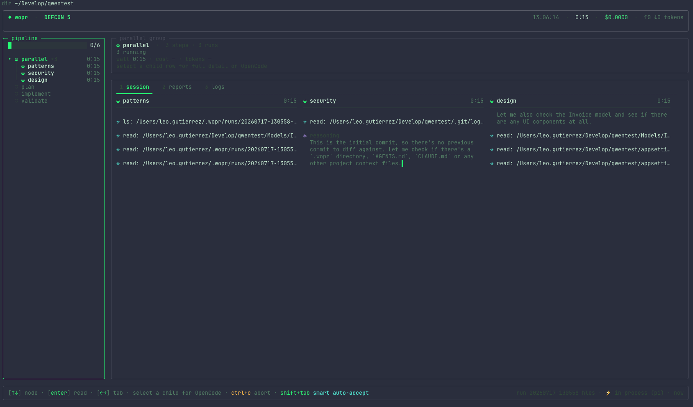

<p align="center">
  
</p>

<p align="center"><em>A self-correcting orchestration harness for multi-model agent pipelines — with a typed core API, an MCP server, and per-run cost caps.</em></p>

<p align="center">
  
</p>

WOPR takes a PRD and turns it into a structured, reviewable implementation: a **pipeline** of specialized agents — implementer, pattern auditor, security auditor, design polisher, test engineer, adversarial reviewer — each step a fresh agent on the model best suited to its job, leaving one commit per phase. Its headline mode is the **converge loop**: a plan→implement→validate cycle that re-plans on the validator's own findings and keeps going until the work passes, stalls, or hits its iteration cap. Every step runs on any model from any provider you're authenticated with in [pi](https://github.com/earendil-works/pi), within the same run.

**Why it exists:** a single agent in a single session produces a first draft, not shippable code. The quality comes from what happens after — pattern alignment, security auditing, tests, adversarial review — and above all from *closing the loop*: feeding a review's verdict back into a fresh plan instead of stopping at "here's what's wrong." That follow-through is the part nobody wants to orchestrate by hand; WOPR makes it repeatable. (Different models catch different things, so reviews can run in parallel across a GPT and a Claude in the same run.)

Typical uses:

- **Converge on a hard change.** `wopr -p converge "what needs to land"` runs a parallel panel review, then loops plan→implement→validate, re-planning from the validator's findings until it reaches PASS (or stalls / exhausts its iterations). An optional evaluation gate runs your build/test between iterations so the verdict is grounded in reality, not vibes.
- **Ship a feature from a PRD.** `wopr --prompt-file prd.md` runs the default `implement` pipeline; what lands has already been pattern-aligned, security-audited, design-polished, tested, and adversarially reviewed — one commit per phase, so you review a story, not a blob.
- **Harden a branch you already have** — hand-written, or another agent's output. `wopr -p refine "what this branch does"` audits the current diff (scope, bugs, clean code, security), triages the findings adversarially, applies only the accepted fixes, and validates them.
- **Get a second opinion before merging.** `wopr -p review "pre-merge check"` changes no code: each audit runs in parallel on two different models and everything is synthesized into one prioritized findings report at `reports/report.md`.
- **Turn up the rigor for risky changes.** `ultra-implement` and `ultra-refine` fan every review out across two models, then finish with a fixer that applies only blocking findings and a final validator.
- **Cap the cost of a run.** `wopr --budget 5.00 --prompt-file prd.md` aborts cleanly if the run would exceed $5. Configurable per-run, per-pipeline, or globally in `.wopr/config.yaml`. The TUI shows a live budget meter alongside the DEFCON meter.
- **Get phone notifications on every phase.** `wopr --notify ntfy://wopr-leo-1234 --prompt-file prd.md` pings your phone (or a self-hosted ntfy server) when each phase finishes and on the validator's verdict. Off by default; opt in per-run or via config.
- **Drive wopr from another coding agent.** `wopr mcp` starts an [MCP](https://modelcontextprotocol.io/) server (stdio transport) that exposes 23 tools over the typed core API. Claude Code, Cursor, Codex, and Continue can call `start_run`, `get_run_status`, `suggest_config_for_budget`, `preview_run`, and 19 more — zero shell, zero `wopr` subprocess.
- **Drive wopr from inside pi.** The `wopr-for-pi` extension at `extensions/wopr-for-pi/` registers the same 22 tools as first-class pi-native tools and ships a skill.md that teaches pi *when* and *how* to use them. Install with `pi extensions install ./extensions/wopr-for-pi`.
- **Encode your team's actual workflow.** Pipelines are YAML in `.wopr/config.yaml`: define, say, a `ship` pipeline — refine the branch, sync it with its base, draft the PR — and run `wopr -p ship`.

Use it as a **CLI** or as a **TUI**, interchangeably: every run can be launched with plain flags and prompt files (`--no-tui` gives you plain logs for pipes and CI), or driven entirely from the TUI — `wopr` with no arguments opens the interactive launcher, every run gets a live dashboard, `wopr runs` browses past runs, and `wopr config` edits global and project config in place.

### Three surfaces

WOPR is reachable from three places, sharing the same engine and the same per-run worktree:

| Surface | Use it from | When |
|---|---|---|
| **CLI / TUI** | `wopr` shell command, or the interactive launcher | You (the human) are driving the run. Flags, prompt files, the dashboard, the runs browser. |
| **MCP server** | `wopr mcp` — 23 tools over [Model Context Protocol](https://modelcontextprotocol.io/) stdio | Another coding agent (Claude Code, Cursor, Codex, Continue) calls wopr programmatically. Zero shell, zero subprocess. |
| **Typed core API** | `import { startRun, listPipelines, suggestConfigForBudget } from "src/core"` | You build a custom transport, a pi extension, an IDE plugin, or anything else. The same functions the MCP server and pi extension both wrap. |

Each surface is a thin layer over the same engine. The CLI/TUI don't go through the MCP server; the MCP server doesn't go through the pi extension — all three consume the core API directly.

**Pipelines are data, not code.** WOPR ships a family of built-ins (see [Built-in pipelines](#built-in-pipelines)) and a project can define its own in `.wopr/config.yaml` — any number of steps, its own agents and models, named human gates anywhere. Beyond sequencing agents, it owns the operational layer: repo-context attachment, a live permission gate, commit safety, phase reports, diff tracking, and the NORAD-styled TUI. It's written in Bun + TypeScript and drives [pi](https://github.com/earendil-works/pi) in-process — no separate server or subprocess, each phase a fresh pi agent session wired to WOPR's permission gate, attachments, and model catalog.

## The default pipeline: `implement`

`implement` is the pipeline wopr runs when you don't pass `-p/--pipeline`.

```
PRD ──► implementer ──► patterns ──► security ──► design ──► tests ──► adversarial
         │               │            │            │          │         │
         └───────────────┴────────────┴────────────┴──────────┴─────────┘
                                          commit per phase
```

| Step | Agent | Default model | What it does |
|---|---|---|---|
| `implementer` | `implementer` | `openai/gpt-5.6-terra#xhigh` | Implements the feature respecting repo patterns |
| `patterns` | `pattern-auditor` | `openai/gpt-5.6-terra#xhigh` | Refactors without changing behavior, aligns with the rest of the code |
| `security` | `security-auditor` | `openai/gpt-5.6-terra#xhigh` | Audits and fixes security issues |
| `design` | `design-polisher` | `openrouter/z-ai/glm-5.2` | Polishes UI following the repo's design system |
| `tests` | `test-engineer` | `openai/gpt-5.6-terra#xhigh` | Automated tests + relevant E2E/integration coverage |
| `adversarial` | `adversarial-reviewer` | `openrouter/z-ai/glm-5.2` | Final adversarial review before PR creation |

The **Default model** column is exactly that — a default. WOPR is model-agnostic: every step runs on whatever model you point it at, from any provider you've authenticated in [pi](https://github.com/earendil-works/pi), and you can mix providers within one run. Override any of these per-step in `.wopr/config.yaml`, globally with `defaults.model`, or for a whole run with `--model`. The pairing that ships — a strong reasoning model for the build/audit/test phases, a cheaper one for design and adversarial review — is just a sensible starting point, not a requirement.

## The converge loop: `converge`

`implement` runs each step once, top to bottom. `converge` instead **closes the loop**: it keeps re-planning from its own review until the work passes.

```
                ┌──────────────── re-plan from validator findings ───────────────┐
                │                                                                 │
panel review ──►│ plan (planner) ──► implement ──► validate (loop-validator) ──► verdict?
(patterns +     │  typed plan       execute it     PASS / PARTIAL / REJECT        │
 security +     │                                    │                            │
 design,        │                        ┌───────────┴───────────┐               │
 read-only,     │                        ▼                       ▼               │
 in parallel)   │                      PASS                 PARTIAL / REJECT ─────┘
                │                     ✓ done            (until maxIterations or a stall)
```

1. **Panel review** — `patterns`, `security`, and `design` read the current diff in parallel, read-only. Their findings seed the loop.
2. **Plan** — the `planner` folds the panel's findings (and, on later iterations, the previous validator's feedback) into a **typed plan**: an ordered list of tasks with rationale.
3. **Implement** — the `implementer` executes that plan, and only that plan.
4. **Validate** — the `loop-validator` reads the resulting diff and emits a structured verdict — `PASS`, `PARTIAL`, or `REJECT` — with the specific findings behind it.
5. **Converge or stop** — `PASS` ends the loop. Otherwise the findings become the next iteration's feedback and it re-plans. It stops early if the plan **stalls** (a new iteration produces materially the same plan without the verdict improving) or hits `maxIterations` (default 3).

An optional **evaluation gate** (`evaluation:` on the loop) runs real commands — install, build, test, and/or run — between iterations, stop-on-first-failure, and feeds their output to the validator, so a `PASS` has to survive your actual test suite rather than the model's say-so.

The dashboard surfaces the loop live: a `CONVERGE 2/3 · verdict ✗ REJECT · re-planning from feedback` line under the header, and the [DEFCON meter](#the-tui-dashboard) escalating as verdicts reject or the plan stalls.

## Built-in pipelines

WOPR ships these pipelines; select one with `-p/--pipeline` (no config needed). A project can add or override any of them in `.wopr/config.yaml`.

| Pipeline | Changes code? | What it does |
|---|---|---|
| `implement` | yes | **The default** (runs with no `-p`). Implement a PRD, then audit, polish, test, and adversarial review (the table above). |
| `implement-lite` _(deprecated)_ | yes | Same workflow and agents as `implement`, but runs the heavy phases (`implementer`, `patterns`, `security`, `tests`) on a lower-cost model instead of the high-end default, for a cheaper implementation run. |
| `ultra-implement` | yes | Like `implement`, but the pattern/security/adversarial reviews of the initial diff run in parallel across two models feeding a triage step, and the run ends with an audit-only final review, a fixer that applies only blocking findings, and a final validator. |
| `refine` | yes | Audit the current diff (scope → bugs → clean-code → security), triage the findings adversarially, apply the accepted fixes, then validate them. |
| `ultra-refine` | yes | Like `refine`, but every read-only audit is fanned out across two models before triage, fixes, and validation. |
| `converge` | yes | **Self-correcting.** A parallel read-only panel review (patterns / security / design), then a plan→implement→validate loop that re-plans on the validator's findings until it passes, stalls, or hits `maxIterations` (see [The converge loop](#the-converge-loop-converge)). |
| `review` | **no — report only** | Scope the diff, run the bug / clean-code(+patterns) / security audits **in parallel across two models each**, then a single step synthesizes everything into one prioritized findings report. Makes no changes; the run's output is `reports/report.md`, which you read to decide whether to follow up with a `refine` run. |
| `review-lite` _(deprecated)_ | **no — report only** | Same as `review`, but the scope step and first audit model drop to a lower-cost model; the second parallel audit model and the final report stay on the high-end default. |

`refine`/`ultra-refine` are the change-applying counterparts of `review`: run `review` first to get a report, then `refine` if you want the fixes applied.

You can also compose your own sequence of agents with `--steps` (or the MCP `steps` array); it takes precedence over a named pipeline. See [AGENTS.md §17](AGENTS.md#17-composing-pipelines-dynamically).

## The MCP server (`wopr mcp`)

`wopr mcp` starts a [Model Context Protocol](https://modelcontextprotocol.io/) server that speaks stdio JSON-RPC and exposes **23 tools** over the typed core API. Once installed, an agent in Claude Code, Cursor, Codex, or Continue can drive wopr end-to-end without shelling out.

### Install

In your agent's MCP config (e.g. `~/.config/claude-code/.mcp.json`, `~/.cursor/mcp.json`, or `~/.codex/config.toml`):

```json
{
  "mcpServers": {
    "wopr": {
      "command": "wopr",
      "args": ["mcp"],
      "cwd": "/Users/me/myapp"
    }
  }
}
```

Restart the agent. It will discover the 22 `wopr_*` tools automatically. See [`docs/mcp-installation.md`](docs/mcp-installation.md) for ready-to-use snippets per agent.

### The 23 tools (at a glance)

| Category | Tools |
|---|---|
| Discovery | `list_pipelines`, `describe_pipeline`, `list_agents`, `describe_agent`, `list_models`, `describe_model` |
| Config | `get_config`, `validate_config`, `diff_config`, `set_config` |
| Planning | `preview_run`, `estimate_cost`, `suggest_config_for_budget` |
| Runs | `start_run`, `get_run_status`, `list_runs`, `get_run_report`, `get_run_cost`, `get_run_diff`, `get_run_commits`, `cancel_run`, `resume_run` |

Each tool maps 1:1 to a function in `src/core/` (the core API). The full signatures and example flows are in [`AGENTS.md`](AGENTS.md) §14 and §15.

### Worked example (Claude Code)

> "Use wopr to add a dark mode toggle. I have $2 to spend."

Claude Code (now armed with the 23 tools) calls them in sequence: `list_pipelines` → `list_models` → `suggest_config_for_budget` → `preview_run` → narrate the plan → user approves → `start_run` → poll `get_run_status` → read `get_run_report` for the verdict → `get_run_cost` and `get_run_diff` for the summary. Zero `wopr` shell calls, zero subprocesses, full state in the model context. The MCP transport is one of several over the same core API — a pi extension does the same thing for pi, a CLI wrapper does it for humans.

## Notifications (`--notify`)

WOPR can ping you on your phone when each phase of a long run finishes, when the validator renders a verdict, and when the run is complete. The transport is [ntfy](https://ntfy.sh) — free, no account, push notifications work on Android and iOS.

### Setup

```bash
# 1. install "ntfy" on your phone (Play Store / App Store, by Philipp C. Heckel)
# 2. in the app, subscribe to a topic (e.g. "wopr-leo-1234")
# 3. verify the wiring before a long run
wopr notify test ntfy://wopr-leo-1234
# → "✅ ntfy.sh/wopr-leo-1234 — sent"
# → check your phone, see the test notification

# 4. use it
wopr --notify ntfy://wopr-leo-1234 --prompt-file prd.md
```

### Events

WOPR fires one notification per event, with priority set by importance:

| Event | Priority | Example title |
|---|---|---|
| `run_started` | default | "wopr · run started" |
| `phase_done` | default | "wopr · implementer done" |
| `phase_failed` (after retries) | high | "wopr · security failed" |
| `verdict_received` | high | "wopr · validator: PASS" |
| `budget_warning` (80% of cap) | high | "wopr · 80% of budget used" |
| `budget_exceeded` | urgent | "wopr · budget exceeded, run aborted" |
| `run_completed` | high | "wopr · run complete" |
| `run_failed` | high | "wopr · run failed" |

### Config

Persistent, in `~/.wopr/config.yaml`:

```yaml
notifications:
  - ntfy://wopr-leo-1234
  - ntfy://ntfy.example.com/wopr-team   # self-hosted
  # future providers (deferred): telegram://, discord://, slack://, pushover://
```

CLI flags override config:

```bash
wopr --notify ntfy://run-only --prompt-file prd.md
wopr --no-notify --prompt-file prd.md   # clear all targets
```

**Off by default.** No `notifications:` in config and no `--notify` flag means no network calls. If ntfy is unreachable, WOPR logs a warning and continues — notifications are operational, never load-bearing.

## Budgets (`--budget`)

WOPR can cap the cost of a run. The cap fires when a phase would push `spent + next_estimate` above the limit; the run aborts cleanly with a clear `BudgetExceededError` if the cap is hit. Off by default — runs without a budget behave exactly as before, except that `metadata.json` now records the actual cost in every run.

### Per-run

```bash
wopr --budget 5.00 --prompt-file prd.md   # hard cap at $5
wopr --budget 5.00 --budget-mode warn --prompt-file prd.md  # soft cap (warn, don't stop)
```

### Per-project (config)

```yaml
# ~/.wopr/config.yaml or .wopr/config.yaml
defaults:
  budget:
    perRun: 5.00
    onExceed: abort  # or "warn-and-continue"

pipelines:
  converge:
    budget:
      perRun: 15.00  # converge is allowed to spend more (self-correcting loop)
```

Precedence: `--budget` CLI flag > `pipelines.<name>.budget` > `defaults.budget` > none.

### MVP caveats

Cost estimation is naive (constant token assumption per phase). Enforcement is **post-hoc**: the cap fires *after* `spent` already exceeds `perRun`, allowing up to one phase of overshoot. For multi-phase pipelines this is fine; for a single-phase pipeline the cap is essentially a no-op. A future "calibration" PRD closes this gap with per-agent historical token averages.

The TUI shows a budget bar alongside the DEFCON meter:

```
PIPELINE: implement  CONVERGE 2/3 · verdict ✗ REJECT  BUDGET $1.23/$5.00 (24%)  DEFCON ▲ 3
```

Past run costs are always visible in `wopr runs` and the runs browser.

## For coding agents

If you're a coding agent reading this: there's a separate manual for you. **[AGENTS.md](AGENTS.md)** is an operational guide — how to invoke wopr, how to pick a pipeline, how to choose models, how to read results, what to avoid. It's structured to be useful to an LLM (concrete commands, decision tables, anti-patterns). Read it on first use; jump to the section you need after that.

## Requirements

- Bun 1.0+
- [pi](https://github.com/earendil-works/pi) installed and authenticated (`pi login`), with the providers you want to use configured in `~/.pi/agent`
- `git`

## Authentication And Providers

WOPR does not store provider credentials. It uses pi's own auth and model registry (`~/.pi/agent`): whatever providers you've logged into with pi are what WOPR can address, and it inherits your shell environment. There is no separate WOPR login.

```bash
pi login                 # authenticate a provider (OpenAI, Anthropic, OpenRouter, Google, …)
pi models                # list the models your configured providers expose
```

Models are addressed as `provider/model` everywhere WOPR takes one (config, `--model`, per-step). A trailing `#variant` maps onto pi's **reasoning effort** (thinking level) — one of `off`, `minimal`, `low`, `medium`, `high`, `xhigh`, `max` — so `openai/gpt-5.6-terra#xhigh` means that model at `xhigh` thinking. Any model pi knows about, from any provider you've authenticated, can be mixed within a single run.

**You decide the models — WOPR only ships defaults.** The default `implement` pipeline pairs a strong reasoning model for the implement, pattern, security, and test phases with a cheaper one for design and adversarial review (the exact defaults are in the [pipeline table above](#the-default-pipeline-implement)). Change any of them per-step in config, set your own `defaults.model`, or override a whole run with `--model`; `implement-lite` is the same pipeline with the heavy phases moved to the cheaper model.

## Installation

```bash
git clone <this-repo> wopr
cd wopr
bun install
make install
```

This leaves `wopr` in `~/.local/bin/wopr` and creates `~/.wopr/config.yaml` plus `~/.wopr/agents/*.md` with WOPR's default configuration if they do not already exist. Make sure `~/.local/bin` is in your `PATH`.

## Usage

From the root of the target repo, ideally on a working branch:

```bash
# interactive launcher: choose a pipeline, enter the prompt, then toggle options
wopr

# inline prompt
wopr "Add onboarding screen with 3 steps and local persistence of progress"

# prompt from file
wopr --prompt-file prd.md

# greenfield: build a brand-new project from a PRD in an empty directory.
# --init-repo creates the git repo and the initial commit for you (no manual
# `git init` needed), then every phase commits on top; phase diffs are measured
# from that root commit. Without --init-repo the CLI expects an existing repo.
mkdir my-app && cd my-app
wopr --prompt-file prd.md --init-repo

# attach files or directories to all phases
wopr --prompt-file prd.md --file src/features/onboarding --file tests/onboarding.test.ts

# run a project-defined pipeline (see "Project configuration" below)
wopr --prompt-file bug.md --pipeline bug-fix
```

<details>
<summary>More flags — single step / skip, resume, run history, config, auth, model &amp; diff control</summary>

```bash
# only one step
wopr --prompt-file prd.md --only implementer

# skip steps
wopr --prompt-file prd.md --skip security,design

# force a different model for all steps
wopr --prompt-file prd.md --model anthropic/claude-sonnet-4-6

# disable the TUI dashboard
wopr --prompt-file prd.md --no-tui

# drop human gates (for pipelines that define them)
wopr --prompt-file prd.md --no-human-step

# isolate the run: create a new branch + git worktree (named from the prompt,
# under ~/.wopr/worktrees) and run there, leaving your current tree untouched.
# The work lands as commits on the new branch; merge it back when you're happy.
# Worktrees are kept for inspection; add --no-keep-worktree (or defaults.keepWorktree:
# false) to auto-remove the checkout after a successful run (the branch is kept).
wopr --prompt-file prd.md --worktree

# resume a failed run (phases that already wrote their report are skipped,
# and the dashboard restores their real duration, cost, and session).
# If a phase was interrupted before its commit and left the working tree dirty,
# an interactive resume asks whether to commit those changes as that phase and
# continue with the following ones.
wopr --resume 20260519-103045-x7q2

# browse run history in the dashboard TUI: a selectable list (newest first,
# with status, date, cost, and prompt) plus a details panel with the per-phase
# breakdown. A run still executing shows a green ● "running" and can be
# attached. ↑/↓ select, [enter] re-open its dashboard (attach if it's live,
# else reconstruct it for inspection), [r]esume (re-runs the failed/unfinished
# phases), [s]ummary/reports overlay, subshell in the run [d]ir under
# ~/.wopr/runs (exit to return), [q]uit.
# Pass a run ID to open the browser with that run preselected.
# Without a TTY (pipes/CI) it falls back to a plain listing.
wopr runs
wopr runs 20260519-103045-x7q2

# view and edit the global (~/.wopr) and current project config in a TUI:
# two tabs (Global / Project), pick models with autocomplete, edit pipelines
# and steps, or initialize a starter config when none exists.
wopr config

# list the isolated worktrees --worktree created (under ~/.wopr/worktrees),
# then reclaim disk by pruning their checkouts. Branches are always kept, so
# committed work is never lost; dirty worktrees are skipped unless --force.
wopr worktrees
wopr worktrees prune

# create project-local config and prompt files you can customize
wopr init

# create global defaults (~/.wopr) instead of project-local
wopr init --global

# overwrite an existing config file
wopr init --force

# auto-allow ask-level permissions (the hard denylist still applies)
wopr --prompt-file prd.md --yolo

# smart auto-accept: an AI judge allows safe requests and escalates risky ones
wopr --prompt-file prd.md --smart --smart-model anthropic/claude-haiku-4-5

# delete the run dir after successful completion (kept by default)
wopr --prompt-file prd.md --no-keep-run-dir

# change the base branch used to calculate diffs between phases
# (when omitted, wopr auto-detects it: origin's default branch, else
# main/master/develop/trunk, else the current branch)
wopr --prompt-file prd.md --base develop

# include existing local changes in the first commit of the pipeline
wopr --prompt-file prd.md --include-dirty --max-attempts 1
```

</details>

### The TUI dashboard

In interactive terminals, WOPR shows a full-screen dashboard headed by a compact run summary (clock, elapsed, cost, tokens) and a **DEFCON meter** — NORAD readiness that reads `DEFCON 5` on a calm run and escalates toward `1` as phases retry, verdicts reject, the plan stalls, or the run fails. During a converge loop a second header line tracks the cycle live: `CONVERGE 2/3 · verdict ✗ REJECT · re-planning from feedback`.

<details>
<summary>Panels, tabs, keys, and the frozen finish screen</summary>

The `pipeline` panel on the left is a tab selector: every step — done, running, or still scheduled — is a row you move through with `↑`/`↓` (or `j`/`k`), or by clicking, with `▸` marking the focused one, and a running phase spins a rotating radar dish. Concurrent groups (a `parallel:` block or a step fanned out across `models:`) render as an indented sub-tree under a group header. Focusing a step drives the whole right side to it: a detail panel (name; whether it's ongoing, done, failed, or scheduled; model; cost; tokens; attempt; files changed) over that step's todo list and a three-tab content panel — switched with `←`/`→`, `Tab`, the number keys `1`/`2`/`3`, or by clicking the tab strip. The tabs are `logs` (the step's color-coded activity feed), `reports` (the markdown report that step wrote, if any, scrollable with `PgUp`/`PgDn` — available live the moment a step finishes, not only at the end), and `session` (a read-only "follow along" view of the step's pi agent session: its live state — reasoning, running a command, editing, applying a diff — model, attempt, cost, diff summary, and a scrolling transcript of what the model is doing, newest at the bottom). A not-yet-started step reads as `scheduled` with its planned model and zeroed usage, so you can inspect what's coming; focus auto-follows the active step until you navigate, and `Esc` hands it back to auto-follow.

The dashboard is a NORAD phosphor "big board": green-on-black on dark terminals, an amber fallback on light ones (green-on-light is unreadable), and a muted green neutral when the terminal doesn't report its background. It never paints backgrounds — the canvas is your terminal's own, and panels are delineated by borders alone, derived as subtle elevations of the reported background color; floating modals repaint the reported color exactly to mask the content beneath them, and it follows live theme changes.

Press `Shift+Tab` to cycle auto-accept modes — off, auto-accept, smart (see the [permission gate](#permission-gate) below). Press `Ctrl+C` once to abort the active session and shut down WOPR cleanly; press it again to force exit if cleanup hangs. Human gates stay inside the dashboard (`c` continue · `i` iterate · `a` abort); without a TTY dashboard they fall back to plain terminal prompts. Use `--no-tui` to fall back to plain logs.

When the run ends (success or failure), the dashboard doesn't close — it stays on the same layout, now frozen for browsing. The pipeline is still the tab selector: move with `↑`/`↓` (or `j`/`k`, or click a phase) to inspect any phase's outcome, duration, model, cost, and diff, and switch its `logs`/`reports`/`session` tabs exactly as during the run (`PgUp`/`PgDn` scroll long reports). Press `g` to open lazygit in the target repo as a subshell — `git log --graph --decorate --stat` is the fallback when lazygit isn't installed. Press `q`, `Esc`, or `Ctrl+C` to close; only then does WOPR clean up the run dir. Failed runs pre-select the failed phase and show its error.

This same finish screen is reachable after the fact from `wopr runs`: pressing `enter` on a run **reconstructs** its dashboard from `metadata.json` + on-disk reports and diffs, for browsing exactly as above (runs still executing are marked with a green ● "running"). Closing it returns you to the run browser.

</details>

## Permission gate

Agents run with a restricted bash policy: a small allowlist of safe Flutter/Dart, web/Node, test/build, and read-only git commands; a denylist of unambiguously dangerous patterns (`git push*`, `gh*`, deployment/publish commands, `sudo*`, recursive deletes against `/` or `~`, `curl … | sh`, package installers); and everything else falls through to `ask`.

When an agent runs a command that isn't on the allowlist, WOPR prints the request and prompts:

```
approve? [o]nce, [a]lways, [r]eject >
```

- `o` allows the single call.
- `a` allows future calls matching the same pattern for the rest of the run.
- `r` rejects the call (the agent receives a denial and decides what to do next).

In non-interactive runs (no TTY), unknown commands are auto-rejected and logged. Per-project, extend the lists with `permissions.allow`/`permissions.deny` in `.wopr/config.yaml`; the global policy lives in `src/agents.ts` (`bashPolicy`).

WOPR also allowlists the target repo's own `package.json` scripts whose names look like checks (`test`, `lint`, `typecheck`, `type-check`, `check`, `build`, `format`, `validate`, including suffixed forms like `test:unit`), excluding anything whose name suggests side effects (`deploy`, `publish`, `release`, `migrate`, `seed`, `reset`). Note the trust model: agents can edit the repo, including script bodies, so allowlisted scripts mean trusting the repo's contents — the denylist protects against accidents, it is not a security boundary against a malicious agent.

### Auto-accept (`--yolo` / `--smart` / `Shift+Tab`)

The permission gate has three states. In the dashboard, `Shift+Tab` cycles through them (`off → auto-accept → smart → off`) and the footer always shows the current one:

- **off** — every request that would normally *ask* prompts you.
- **auto-accept** (`--yolo`) — every ask-level request is allowed automatically (replied as "once") and logged to the activity feed. Switching into this state also resolves any prompts already queued.
- **smart** (`--smart`) — each request is handed to an external AI judge running *outside* the agentic loop (a single stateless prompt with every tool disabled, so it can only classify, never act). Requests it judges safe — read-only, local, reversible, no secrets, no exfiltration — are auto-allowed with the reason logged; anything it flags as risky (or any judge error/timeout) falls back to prompting you, with the flag shown in the modal. It is deliberately fail-closed: uncertainty never auto-approves.

The judge model is `--smart-model <provider/model[#variant]>`, falling back to `defaults.autoAcceptJudgeModel` in config, then the run's model. The hard denylist is enforced by WOPR's bash policy and is never relaxed: denied commands are rejected before they ever reach the gate, in every state.

## Commit safety

Before each commit WOPR scans the staged files for common secret names (`.env*`, `*.pem`, `*.key`, `id_rsa*`, `credentials*`, `*.p12`, `*.keystore`, ...). If any match, the commit is aborted, the index reset, and WOPR asks you to add them to `.gitignore` (or delete them) before re-running. Combined with `--include-dirty` this is the only line of defense against accidentally publishing a secret your working tree had lying around — review the resulting commits with `git show` before pushing.

During a human step, WOPR waits indefinitely for an explicit action: `c` continues the pipeline (committing any manual changes), `i` iterates (hands the step back for another pass with your feedback), and `a` aborts the run.

## Project configuration (`.wopr/config.yaml`)

A project can reshape wopr entirely from one file. Everything is optional — the file only declares what differs from the defaults. The same schema also lives globally at `~/.wopr/config.yaml` (see [Global configuration](#global-configuration)); the project file is merged on top of it.

<details>
<summary>Full annotated <code>.wopr/config.yaml</code> example</summary>

```yaml
version: 1

defaults:
  model: openai/gpt-5.6-terra#xhigh     # provider/model[#variant], used by steps with no model of their own
  maxAttempts: 2
  baseRef: main                    # optional; auto-detected when unset (origin default branch, else main/master/develop/trunk, else current branch)
  pipeline: quick                  # pipeline used when -p/--pipeline is not given
  autoAcceptJudgeModel: anthropic/claude-haiku-4-5   # model for smart auto-accept (--smart); defaults to the run's model
  branchNameModel: anthropic/claude-haiku-4-5        # model that names worktree branches (may look up referenced issues)
  keepWorktree: false              # auto-remove a --worktree checkout after a successful run (branch kept); default true

# Project agents: the prompt lives at .wopr/agents/<name>.md (required).
# Naming a built-in agent here overrides its model/temperature/readOnly instead.
agents:
  api-reviewer:
    description: Reviews public API consistency
    model: anthropic/claude-opus-4-8
    temperature: 0.1
    readOnly: true               # disables write/edit/bash tools for this agent

pipelines:
  quick:
    description: Implementation, manual gate, tests
    steps:
      - implementer                # string = agent (or alias) with that step name
      - type: human                # named human gate, placeable anywhere, repeatable
        name: planning
        description: Plan implementation interactively
      - agent: tests
        maxAttempts: 3
  api:
    steps:
      - implementer
      - api-reviewer               # project agent defined above
      - type: human
        name: api-review
      - agent: security
        reports: all               # attach every previous step report (default: the nearest one)
      - agent: adversarial
        name: final-check          # step name (report file, commit prefix, --only/--skip)
        reports: [implementer, security]
  audit:
    steps:
      - implementer
      - parallel:                  # runs its steps concurrently; every one is forced read-only
          - patterns
          - security
          - agent: clean-code
            models:                # fans this one step out across models, one read-only run per model
              - anthropic/claude-opus-4-8
              - openai/gpt-5.6-terra#xhigh
      - agent: adversarial
        name: triage
        reports: all               # every parallel/fan-out report from above, in one attachment set

hooks:                              # optional shell hooks; top-level = every pipeline
  pre:
    - pnpm lint
  post:
    - command: ./scripts/notify.sh
      when: always                  # success | failure | always; post default is success
      continueOnError: true         # don't fail the run if this hook fails
  pipelines:                        # appended only for the named pipeline
    quick:
      post:
        - name: open-pr
          command: gh pr create --fill
          cwd: target               # target (default) | run
          timeoutSeconds: 120

permissions:                       # additive only; a config allow can never undo a deny
  allow:
    - "supabase gen types*"
  deny:
    - "stripe *"

attachments:                       # attached to every step, like repeatable --file flags
  - docs/architecture.md
```

</details>

The rules:

- **Precedence**: CLI flag > project config > global config > built-in default. Within a config, for models specifically: step `model` > agent `model` > `defaults.model` > the agent's built-in preference (Opus for design/adversarial when the step doesn't set its own model) > `openai/gpt-5.6-terra#xhigh`. `--model` overrides everything.
- **Conventions over wiring**: every agent step gets the PRD, the cumulative diff against the base branch (except the first step; opt out with `diff: false`), and the previous step's report (`reports: previous|all|none|[names]`). Its report lands at `reports/<step>.md` and its commit is `wopr(<step>): …`.
- **Aliases**: the built-in agents answer to their short names in steps — `patterns`, `security`, `design`, `tests`, `adversarial` — as well as their full names.
- **Read-only agents**: set `agents.<name>.readOnly: true` to enforce audit-only behavior. WOPR disables the agent's write/edit/bash tools, denies edit/bash/task permissions, and saves the phase report from the assistant response if the agent cannot write it directly.
- **Human steps**: use `type: human` with optional `name` and `description` to insert an interactive gate. The old `human-review` string still works as a legacy shorthand, but named `type: human` steps are preferred for planning, QA, approval, or any other human checkpoint.
- **Parallel steps and model fan-out**: wrap steps in `parallel: [...]` to run them concurrently, and/or give one step a `models: [...]` list (instead of `model:`) to run it once per model. Both are always forced read-only, regardless of the underlying agent's own `readOnly` setting, so concurrent runs can never step on each other's changes to the tree — there's no per-step way to opt out. A `models:` step's variants get disambiguated names (`<step>__<model-slug>`) and reports; `reports: previous` after a parallel block attaches every member's report, and `reports: [<step-name>]` on a fanned-out step's un-suffixed name attaches every one of its model variants. `parallel:` can't nest and can't contain human steps.
- **Project pipelines shadow built-ins**: defining `pipelines.implement` replaces the built-in default pipeline.
- **`--no-human-step` / `--no-human-review`** (and non-TTY runs) drop every human gate from the pipeline.
- **Resume is frozen**: the resolved pipeline is persisted in the run's `metadata.json`; `--resume` replays it even if the config changed since.
- **Dirty-tree recovery**: a phase interrupted before its commit (Ctrl+C, a failed commit step, a killed process) leaves uncommitted work in the tree, which normally blocks `--resume`. In an interactive terminal, resume offers to commit that work as the interrupted phase (`wopr(<phase>): …`), mark it done, and continue with the following phases. Decline (or a non-TTY resume) keeps the old "commit/stash first" behavior.
- **Permissions are additive**: `permissions.deny` extends the hard denylist, `permissions.allow` extends the allowlist, deny always wins, and there is deliberately no way for a repo to grant itself `--yolo`.
- **Hooks are trusted local shell commands**: `hooks.pre` runs after the run workspace/dashboard is initialized and before the pipeline starts (pre-hooks are skipped on `--resume`); `hooks.post` runs at the end according to `when`. Top-level hooks apply to every pipeline, and `hooks.pipelines.<name>` entries are appended for that pipeline. Hooks run via `$SHELL -lc` from the target repo by default, receive `WOPR_RUN_ID`, `WOPR_RUN_DIR`, `WOPR_TARGET_DIR`, `WOPR_PIPELINE`, `WOPR_PROMPT_FILE`, and post-hooks also receive `WOPR_RUN_STATUS`. A failing hook fails the run unless `continueOnError: true` is set. Each hook is also a row in the dashboard pipeline — pre-hooks ahead of the steps, post-hooks after — with live running/✓/✗/skipped status, and the tail of its output lands in that row's `logs` tab; the rows are recorded in the run metadata, so re-opened runs show them too.

## Global configuration

`~/.wopr/config.yaml` uses the exact same schema as the project file and sets your personal defaults across every repo — most usefully `defaults.model`, but also custom agents and pipelines. Global custom agents bring their prompt at `~/.wopr/agents/<name>.md` (the same convention a project uses, relative to your home).

Both files are merged before a run, with the project winning: `defaults`, `agents`, and `pipelines` merge by key/name (a project entry overrides the global one of the same name), while `permissions`, `hooks`, and `attachments` concatenate (global first; `deny` still wins). The home directory wopr reads can be relocated with `WOPR_HOME` (it points at the directory that holds `.wopr`, and also moves `~/.wopr/runs`).

## Editing config interactively (`wopr config`)

`wopr config` opens a TUI to view and edit both configs without hand-editing YAML — two tabs, **Global** (`~/.wopr/config.yaml`) and **Project** (the current repo's `.wopr/config.yaml`):

- Pick models from an autocompleting list: it reads pi's model registry for the models your configured providers expose (including reasoning variants like `#xhigh`), falling back to the full [models.dev](https://models.dev) catalog when the registry is empty, and always accepts a free-typed `provider/model[#variant]`.
- Edit `defaults` (model, autoAcceptJudgeModel, branchNameModel, maxAttempts, baseRef, pipeline) and each agent's model/temperature override. Agent `readOnly` is displayed when set; edit it in YAML.
- Browse pipelines and their steps; add, delete, reorder steps, set a per-step model or max-attempts, and add new pipelines. Permissions, hooks, and attachments are shown read-only (edit those in the YAML).
- When a tab has no file yet, `initialize` writes a starter config (the built-in `implement` pipeline, expanded and ready to edit).

Keys: `↑/↓` move, `enter` edit/expand, `tab` switch tab, `a` add, `d` delete a step, `shift+↑/↓` reorder a step, `t` agent temperature, `m` step max-attempts, `s` save the active tab, `q` quit. Saving re-validates and rewrites clean YAML (comments are not preserved); the dashboard never paints backgrounds, like the run TUIs. Needs an interactive terminal.

## Initializing config files (`wopr init`)

`wopr config` is interactive; `wopr init` is its non-interactive counterpart: it writes a commented starter config and copies the built-in agent prompts so you can customize them in place.

```bash
wopr init                # .wopr/config.yaml + .wopr/agents/*.md in the current repo
wopr init --dir ../app   # same, in another repo
wopr init --global       # ~/.wopr/config.yaml + ~/.wopr/agents/*.md
wopr init --force        # overwrite existing files
```

The generated config documents every key (commented out) and inlines the built-in `implement` pipeline so it's immediately editable. The copied `agents/*.md` prompts are picked up by name — edit them to override a built-in agent's prompt, or declare a new agent in the config and add its prompt file. Existing files are never overwritten unless `--force` is given. `make install` runs `wopr init --global` automatically, so a fresh install ships with a ready-to-edit global config.

## Project Context And Custom Agents

WOPR automatically attaches these target-repo files to every phase when they exist:

```text
.wopr/rules.md
AGENTS.md
CLAUDE.md
```

Use `.wopr/rules.md` for project-specific WOPR instructions. It is intentionally the only WOPR rules filename to avoid ambiguous precedence. `AGENTS.md` and `CLAUDE.md` are treated as additional repo context.

Built-in agent prompts live as Markdown files under `prompts/`. A project can fully replace a built-in agent prompt with:

```text
.wopr/
├── config.yaml          # defaults, agents, pipelines, hooks, permissions, attachments
└── agents/
    ├── implementer.md   # overrides the built-in implementer prompt
    ├── pattern-auditor.md
    └── api-reviewer.md  # prompt for a project agent declared in config.yaml
```

When a project override exists, it replaces that agent's built-in prompt completely. Project agents declared in `config.yaml` must bring their prompt at `.wopr/agents/<name>.md` (validated at startup). The same convention applies globally: `~/.wopr/agents/<name>.md` overrides a built-in for every repo. Prompt precedence is `.wopr/agents/<name>.md` (project) > `~/.wopr/agents/<name>.md` (global) > the built-in prompt. In all cases WOPR still appends its non-replaceable runtime safety guard rails from `prompts/runtime-safety.md`.

## Efficient Attachments

`--file` is repeatable and accepts files or directories. Relative paths are resolved against the target repo.

WOPR doesn't paste those contents into the prompt. It hands them to the pi agent session as file parts (by `file://` path), not inlined text, and does the same internally with `prd.md`, previous reports, and phase diffs.

## Anatomy of a Run

Each invocation creates `~/.wopr/runs/<run-id>/`:

```
~/.wopr/runs/20260519-103045-x7q2/
├── prd.md
├── metadata.json
├── reports/
│   ├── implementer.md
│   ├── patterns.md
│   ├── security.md
│   ├── design.md
│   ├── tests.md
│   └── adversarial.md
├── diffs/
│   ├── patterns.pre.diff
│   ├── security.pre.diff
│   ├── design.pre.diff
│   ├── tests.pre.diff
│   └── adversarial.pre.diff
├── logs/
│   ├── implementer.1.json
│   └── ...
└── SUMMARY.md
```

`metadata.json` records the resolved pipeline the run executes plus each step's status, session ID, timing, cost, tokens, and model as the run progresses (written atomically, debounced). On `--resume`, the frozen pipeline is replayed — even if `.wopr/config.yaml` changed since — and steps that already wrote their report are restored in the dashboard with their real duration, cost, and session, which can still be opened by clicking the pipeline row.

The run dir is kept after the run by default (browse it with `wopr runs`); pass `--no-keep-run-dir` to delete it on successful completion. If the run fails, it's always preserved for inspecting reports, diffs, and logs.

The target repo only sees commits with prefix `wopr(<phase>): ...`, made on the current branch. Normal runs leave no CLI files in the project; `wopr init` intentionally creates `.wopr/config.yaml` when you want project-local configuration.

## Development

```bash
bun install
bun run typecheck
bun test
bun run build
```

## Structure

```
wopr/
├── src/
│   ├── main.ts          # entrypoint
│   ├── cli.ts           # flag parsing, subcommand dispatch
│   ├── runner.ts        # pipeline orchestration, event hooks (notifications, metrics)
│   ├── pi.ts            # pi runtime: model registry, auth, per-phase agent session
│   ├── core/            # typed core API for agent integrations (22 exported functions)
│   │   ├── discovery.ts   # listPipelines, listAgents, listModels, …
│   │   ├── config.ts      # getConfig, setConfig, validateConfig, diffConfig
│   │   ├── planning.ts    # previewRun, estimateCost, suggestConfigForBudget
│   │   ├── runs.ts        # startRun, getRunStatus, getRunReport, cancelRun, …
│   │   ├── errors.ts      # typed errors (ConfigError, RunNotFoundError, …)
│   │   └── index.ts       # barrel
│   ├── mcp/             # wopr mcp — 22-tool MCP server (stdio, JSON-RPC)
│   ├── notifications/   # --notify flag, wopr notify test, ntfy client + dispatcher
│   ├── loop.ts          # converge-loop control: plan signature, verdict progress, stall detection
│   ├── evaluate.ts      # optional evaluation gate: install/build/test/run between iterations
│   ├── plan-schema.ts   # typed Plan / Verdict parsing for the converge loop
│   ├── agents.ts        # prompt loading, agent config, bash policy
│   ├── project-context.ts # automatic .wopr/rules.md, AGENTS.md, CLAUDE.md discovery
│   ├── permissions.ts   # live permission gate for tool calls that fall outside the allowlist
│   ├── safety-judge.ts  # external AI judge for smart auto-accept (tool-less, fail-closed)
│   ├── attachments.ts   # file parts for --file and internal attachments
│   ├── git.ts           # diff, commit, and pre-commit secret scan
│   ├── workspace.ts     # run dir, ~/.wopr home (WOPR_HOME), global config/agents paths
│   ├── runs.ts          # interactive run-history browser (wopr runs)
│   ├── runs-tui.ts      # run-history browser rendering
│   ├── metadata.ts      # per-run metadata.json: frozen pipeline + --resume restore
│   ├── config.ts        # config loader/validation, global+project merge, YAML writer
│   ├── config-tui.ts    # interactive config editor (wopr config)
│   ├── cost.ts          # naive cost estimation: rate × tokens
│   ├── suggest.ts       # suggestConfigForBudget: pick a config that fits a budget
│   ├── usage.ts         # CostTracker, PhaseUsage, token aggregation
│   ├── model-catalog.ts # available-model list via pi's registry, models.dev fallback
│   └── pipeline.ts      # built-in agents/pipeline and pipeline-spec resolution
├── prompts/             # built-in agent prompts and runtime safety guard rails
├── docs/                # mcp-installation.md and other agent-facing docs
├── test/                # unit + integration tests
│   ├── core/            # tests for the core API
│   ├── mcp/             # tests for the MCP server
│   └── notifications/   # tests for the notifications module
├── AGENTS.md            # operational manual for coding agents
├── CHANGELOG.md         # release notes
├── package.json
├── tsconfig.json
└── Makefile
```
